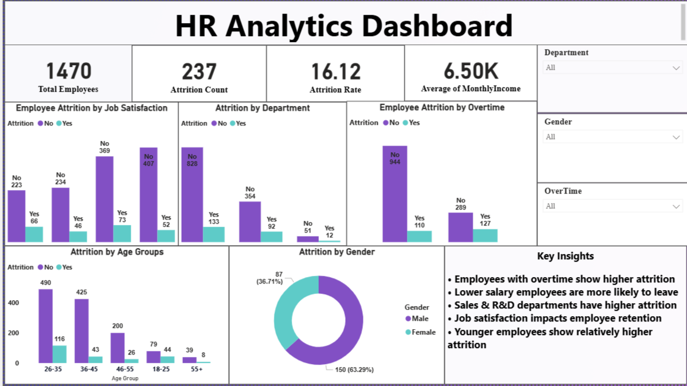

# HR Analytics Dashboard

## Project Overview

This project analyzes employee workforce and attrition data using **Python, Pandas, exploratory data analysis (EDA), and Power BI**.

The analysis covers **1,470 employees across 35 attributes** and focuses on identifying workforce patterns associated with employee attrition, including overtime, department, age, income, gender, and job satisfaction.

An interactive Power BI dashboard was developed to monitor key HR metrics and help identify employee groups that may require greater retention attention.

---

## Business Problem

Employee attrition can increase recruitment costs, reduce organizational productivity, and lead to the loss of experienced employees.

The objective of this project is to analyze workforce data and identify characteristics associated with employee attrition so that HR teams can make more informed retention and workforce-management decisions.

### Business Questions

The analysis focuses on:

- What is the overall employee attrition rate?
- Does overtime appear to be associated with higher attrition?
- Which departments have the highest attrition counts?
- How does attrition vary across age groups?
- How does employee income differ between retained and attrited employees?
- How does job satisfaction differ between retained and attrited employees?
- Is there a substantial difference in attrition patterns by gender?
- Which employee groups may require greater retention attention?

---

## Tools & Technologies

| Technology | Purpose |
|---|---|
| Python | Data analysis and exploratory analysis |
| Pandas | Data manipulation |
| NumPy | Numerical operations |
| Matplotlib | Data visualization |
| Seaborn | Exploratory visualization |
| Power BI | Interactive HR dashboard |
| DAX | KPI and dashboard calculations |
| VS Code | Development environment |

---

## Dataset Information

The dataset contains **1,470 employee records across 35 columns**.

The dataset includes information related to:

- Employee demographics
- Age
- Gender
- Department
- Job role
- Monthly income
- Overtime
- Job satisfaction
- Environment satisfaction
- Work-life balance
- Years at company
- Total working years
- Performance rating
- Employee attrition

### Dataset Summary

| Metric | Value |
|---|---:|
| Total Employees | 1,470 |
| Total Attributes | 35 |
| Attrited Employees | 237 |
| Retained Employees | 1,233 |
| Attrition Rate | 16.12% |
| Average Monthly Income | 6,502.93 |
| Missing Values | 0 |
| Exact Duplicate Rows | 0 |

---

## Data Preparation

The dataset was reviewed before analysis to ensure that it was suitable for workforce and attrition analysis.

The preparation process included:

- Reviewing dataset dimensions
- Inspecting column names and data types
- Checking for missing values
- Checking for duplicate records
- Reviewing categorical HR variables
- Validating numerical employee attributes
- Preparing employee groups required for analysis and visualization

The dataset contains **no missing values and no exact duplicate rows**.

---

## Exploratory Data Analysis

EDA was performed to understand employee attrition across important workforce characteristics.

The analysis focused on:

- Overall attrition distribution
- Overtime and attrition
- Department-wise attrition
- Age and attrition
- Monthly income and attrition
- Job satisfaction and attrition
- Gender and attrition
- Employee demographic patterns

---

## Power BI Dashboard

An interactive Power BI dashboard was developed to provide an executive-level view of workforce attrition.

### KPI Cards

| KPI | Result |
|---|---:|
| Total Employees | 1,470 |
| Attrition Count | 237 |
| Attrition Rate | 16.12% |
| Average Monthly Income | 6.50K |

### Dashboard Visualizations

The dashboard includes:

- Employee Attrition by Job Satisfaction
- Attrition by Department
- Employee Attrition by Overtime
- Attrition by Age Groups
- Attrition by Gender
- Department filter
- Gender filter
- Overtime filter
- Key HR insights

---

## Dashboard Preview



---

## Key Insights

### Overtime

Employees working overtime show a considerably higher attrition proportion.

Among employees working overtime, **127 employees left compared with 289 who remained**, while among employees not working overtime, **110 left compared with 944 who remained**.

This makes overtime an important workforce characteristic for further retention analysis.

### Department

Research & Development records the largest attrition count with **133 employees**, followed by Sales with **92 employees** and Human Resources with **12 employees**.

Because department sizes differ substantially, attrition counts should be interpreted together with department population rather than being treated as attrition rates.

### Monthly Income

Employees who left the organization have an average monthly income of approximately **4,787**, compared with approximately **6,833** among employees who remained.

This indicates an association between lower income and attrition in this dataset, although it does not by itself establish that lower income causes employees to leave.

### Age

Employees who left have an average age of approximately **33.6 years**, compared with approximately **37.6 years** among retained employees.

The dashboard also shows relatively high attrition among younger employee groups.

### Job Satisfaction

Average job satisfaction is lower among employees who left than among employees who remained.

This suggests that job satisfaction may be useful when identifying employee groups requiring additional retention attention.

### Gender

Of the 237 employees who left, **150 are male and 87 are female**.

Gender alone should not be interpreted as a causal driver of attrition, and the difference should be considered alongside the underlying workforce composition.

---

## Business Recommendations

Based on the analysis:

1. **Review overtime workload**  
   HR teams should investigate teams and roles with persistent overtime and evaluate workload distribution, staffing levels, and employee well-being.

2. **Strengthen retention among younger employees**  
   Career development, mentorship, onboarding, and internal growth opportunities may help improve retention among early-career employees.

3. **Review compensation patterns**  
   Since attrited employees have lower average monthly income in this dataset, compensation competitiveness should be investigated alongside job level, role, experience, and performance.

4. **Monitor employee satisfaction**  
   Job satisfaction indicators can be incorporated into regular employee-engagement monitoring to identify groups that may require attention.

5. **Analyze departments using attrition rates**  
   Department size should be considered when comparing workforce risk. Attrition rates provide a better comparison than raw attrition counts alone.

6. **Use multiple indicators together**  
   Overtime, income, age, department, satisfaction, tenure, and job characteristics should be analyzed together rather than using any single factor to predict employee behavior.

---

## Project Structure

```text
hr-analytics-dashboard/
│
├── Data/
│   └── HR Employee Attrition dataset
│
├── Notebooks/
│   └── Python EDA and HR analysis
│
├── Dashboard/
│   └── Power BI dashboard
│
├── screenshots/
│   └── hr_dashboard.png
│
├── requirements.txt
│
└── README.md
```

---

## How to Reproduce the Project

1. Clone or download this repository.
2. Load the HR dataset from the `Data` directory.
3. Install the Python dependencies listed in `requirements.txt`.
4. Run the analysis notebook from the `Notebooks` directory.
5. Review the exploratory analysis and generated insights.
6. Open the Power BI dashboard from the `Dashboard` directory.
7. Validate dashboard KPIs against the source dataset.

---

## Key Learnings

This project demonstrates practical experience with:

- HR analytics
- Employee attrition analysis
- Data quality validation
- Exploratory Data Analysis
- Workforce segmentation
- Python-based data analysis
- Power BI dashboard development
- DAX-based KPI development
- Translating workforce data into business recommendations

---

## Author

**Tushar Sharma**

Data Analyst | SQL | Python | Power BI | Tableau | AWS | Snowflake

GitHub: `imtusharsharma-45`
